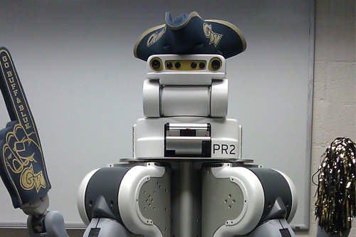

### Our Mission

The Positronics Lab at The George Washington University investigates how to get robots to perform tasks faster and with greater dexterity than humans and animals.

Two tools that we use to conduct this research are multibody dynamics and simulation with contact and impact, for which we have written and maintain the open source libraries [Ravelin] and [Moby].

We plan to use fast, dexterous robots to improve human quality of life, primarily by allowing humans to age within our homes.

[Ravelin]: /Ravelin
[Moby]: /Moby
[Pacer]: https://github.com/PositronicsLab/Pacer

